# insideside music — обзор возможностей

Персональный музыкальный плеер: сервер на своём компьютере плюс одностраничное
приложение, которое ставится на iPhone как PWA. Вся библиотека — ваши файлы на
вашем диске; ни подписки, ни облака, ни чужих рекомендаций.

Скриншоты сняты на изолированном экземпляре с каталогом из **2503 треков**.

---

## Плеер: три вида, один транспорт

Вид выбирается в правом верхнем углу и переживает перезапуск.

### Винил

Пластинка крутится в такт воспроизведению, тонарм едет по радиусу вместе с
позицией трека. **Пластинку можно крутить пальцем** — это перемотка со звуком
скретча, как на настоящей вертушке. Фон подбирает цвет под обложку и меняется
вместе с треком.

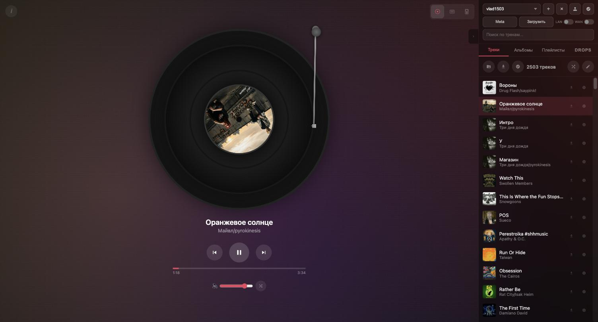

### Кассета

Катушки наматываются по мере воспроизведения: левая худеет, правая растёт.
Подпись на боковине — название трека и исполнитель.

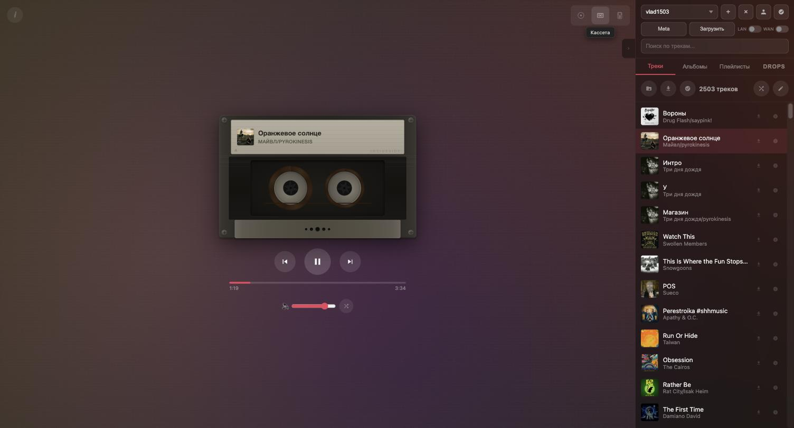

### iPod

Экран Now Playing и колесо прокрутки, которое работает: по кругу листается
список, в режиме плеера — перематывается трек, с характерными щелчками.

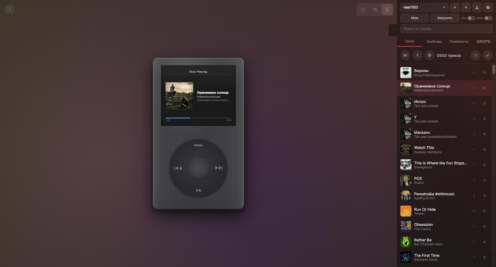

### Список убирается

Панель со списком сворачивается одной кнопкой — остаётся только пластинка.

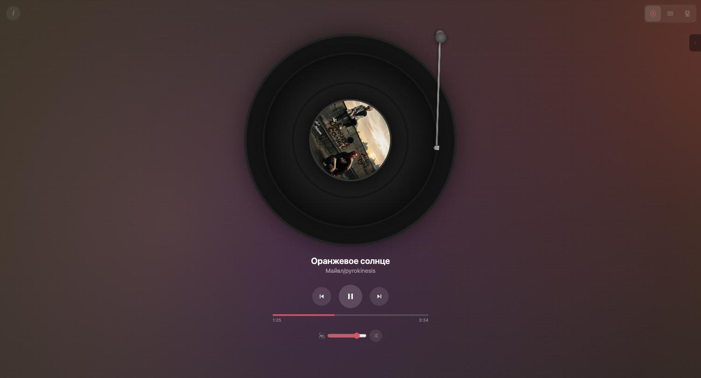

---

## Библиотека

### Треки и поиск

Поиск ищет **и по тегам, и по имени файла**, потому что они расходятся:
`Smack That (Slowed & Reverb).mp3` на диске против `Smack That(Slowed &
Reverb)` в теге, `Артист, Артист` против `Артист/Артист`. Пунктуация
схлопывается в пробелы, слова матчатся по «И».

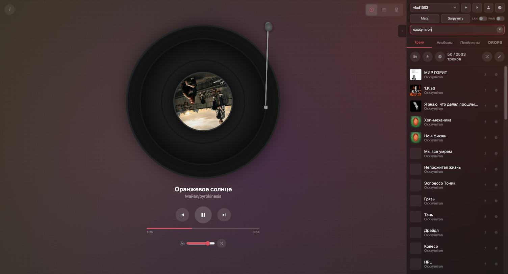

Каталогов может быть несколько (переключатель вверху), треки перетаскиваются
мышью для смены порядка, есть режим выделения для групповых операций и
скачивание каталога ZIP-архивом.

### Альбомы

Те же треки, сгруппированные по тегу альбома, — 1445 альбомов на этой
библиотеке. Альбом играется целиком и кэшируется одной кнопкой.

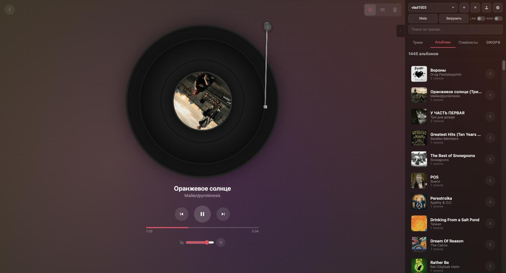

---

## Плейлисты

Экран разделён на два раздела с постоянными заголовками: природа у них разная —
состав **вычисляется** против собранного руками.

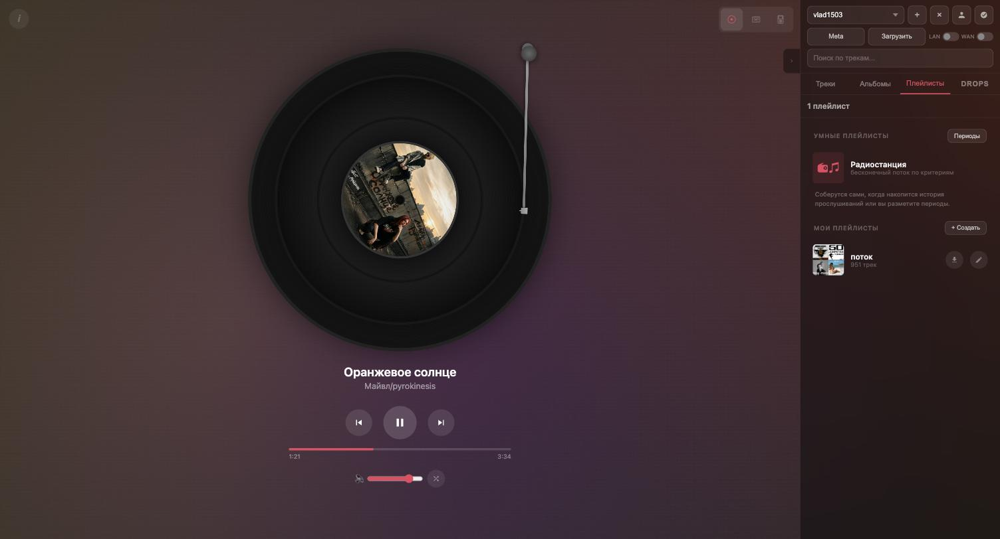

### Периоды прослушивания

Каталог отсортирован от свежих треков к старым. Размечаете пачки номеров
годами — из разметки сами собираются плейлисты «Слушал в 2016».

Главное здесь: **границы хранятся якорями, а не номерами.** Якорь — это имя
файла на краю диапазона. Номер как граница прожил бы до первого импорта, потому
что импорт перенумеровывает каталог целиком. С якорем всё сходится само:
проверено полной перенумерацией (2440 файлов сдвинуты на +1) — границы остались
на тех же треках. Период, начинающийся с первого трека, открыт сверху, и новая
музыка попадает в текущий год сама.

Окно показывает, какие именно треки легли на края, — иначе проверить себя
невозможно.

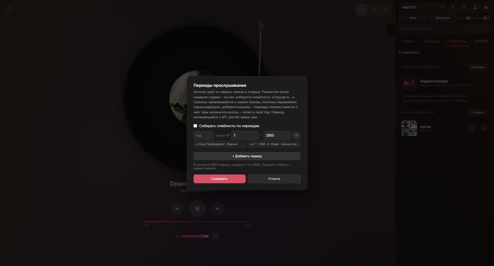

---

## Радиостанция

Бесконечный поток по критериям. **В сеть станция не ходит ни разу** — всё
считается локально, поэтому работает и без сервера (пул сам сужается до кэша).

Критерии выведены из того, чем реально располагает библиотека, а не из теории.
Живой счётчик внизу показывает, сколько треков попадает под текущий отбор, —
без него непонятно, почему станция вдруг крутит полтора альбома.

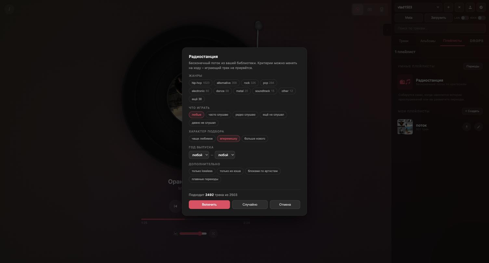

Две вещи, на которые стоит обратить внимание:

* **жанры схлопнуты по корню**, русский и английский — в одну корзину. В тегах
  одно и то же пишут как «Alternative», «Alt. Rock», «ALTERNATIVE/EXPERIMENTAL»,
  «alternetive» с опечаткой, «альтернатива», «Альтернативный рок». На живой
  библиотеке выбор дробился на 33 пункта, где половина — синонимы; после
  схлопывания alternative собрал 358 вместо трёх разных корзин;
* **«часто» и «редко» — это доля, а не порог.** Порог вырождается: послушайте
  всё поровну, по четыре раза, — и «не меньше четырёх» выполнится для всей
  библиотеки. Берётся верхняя и нижняя четверть рейтинга, то есть всегда
  относительно вашей собственной активности.

Критерии можно менять на ходу — играющий трек не прервётся.

---

## DROPS — новинки артистов вашей библиотеки

Список отслеживаемых артистов **нигде не хранится**: он выводится из самой
библиотеки при каждом обновлении, поэтому переживает любое изменение каталога.
Источники — iTunes Search API и Deezer, оба без ключей.

### NEW — свежее

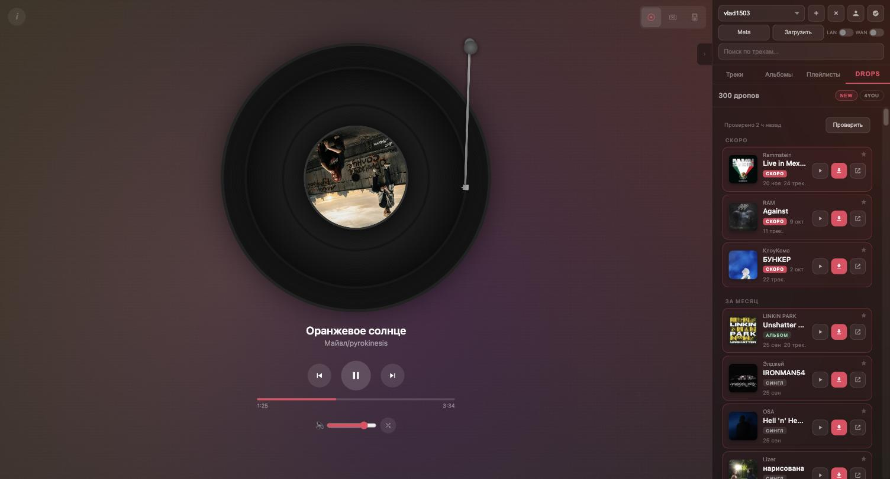

### Состав релиза и отрывки

Тап по карточке раскрывает список треков; кнопка ▶ играет 30-секундный отрывок.
Отрывки тянутся **только по нажатию** — тащить их для всей ленты означало бы
сотни лишних обращений.

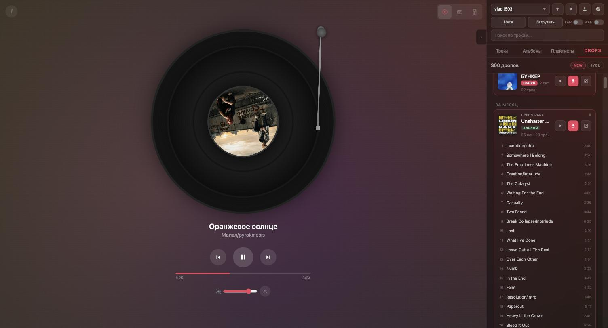

### 4YOU — рекомендации

Остальной каталог тех же артистов: то, что старее окна новинок и чего в
библиотеке ещё нет. **Ни своего кэша, ни своих запросов к API у 4YOU нет** —
это те же данные, которые раньше просто нигде не показывались: 5297 записей и
ноль дополнительных обращений к сети.

Ранжирование идёт **по кругу артистов**, а не сортировкой по весу: вес у всех
релизов одного артиста одинаковый, и обычная сортировка отдала бы первые
25 карточек одному исполнителю.

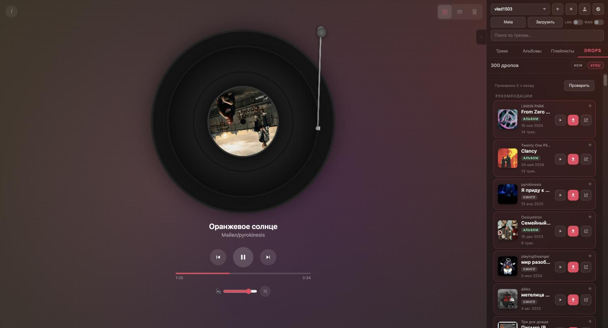

Понравившийся релиз отмечается звёздочкой и остаётся в ленте, даже когда выпал
из окна дат. Кнопка загрузки передаёт релиз прямо в окно импорта.

---

## Импорт

Шесть источников в одном окне: VK, Яндекс, Spotify, Apple Music, SoundCloud и
поиск по названию. Треки добавляются в начало или конец каталога, порядок можно
сохранить как в плейлисте-источнике. Рядом — загрузка файлов с этого
компьютера.

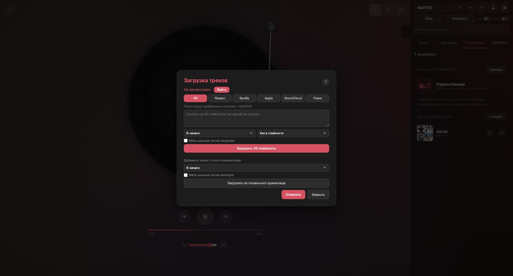

После импорта теги дозаполняются автоматически: название, исполнитель, альбом,
год, жанр, номер трека, album artist и обложка. Заполняется **только пустое** —
свой тег никогда не переписывается.

---

## Метаданные трека

Кнопка «i» в строке: все теги, длительность, битрейт, формат и обложка.
Смотреть хочется чаще, чем править, поэтому просмотр — основной режим, а правка
спрятана за переключателем.

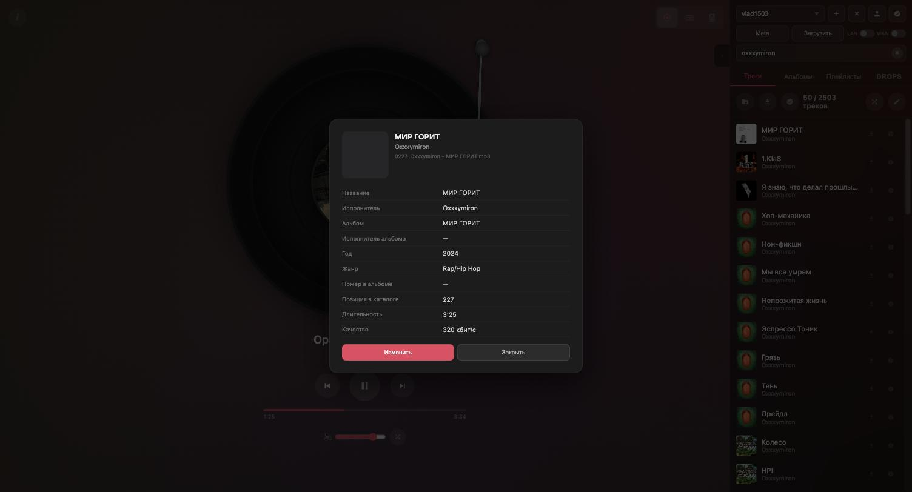

---

## Офлайн и PWA

Приложение ставится на домашний экран iPhone и работает без сервера:
треки лежат в IndexedDB браузера, каталог и плейлисты — в localStorage.

Зелёная точка в строке — трек в кэше.

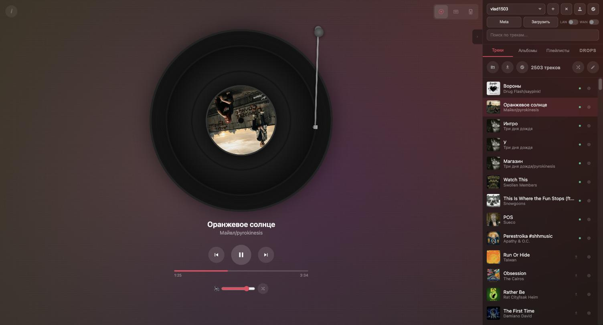

Фильтр «только из кэша» показывает ровно то, что заиграет без связи.

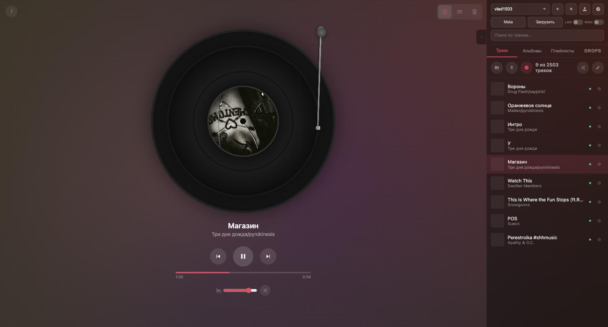

Что работает без сервера:

| Работает | Не работает |
|---|---|
| воспроизведение из кэша | импорт новых треков |
| поиск, альбомы, плейлисты | правка тегов, перемещение файлов |
| радиостанция и умные плейлисты | удаление (намеренно: сервер здесь истина) |
| лента DROPS из зеркала | — |
| отметки избранного и прослушиваний | — |

Отметки и прослушивания копятся локально и досылаются при первом же
подключении. Удаление не откладывается **никогда**: разослать случайную потерю
по всем устройствам хуже, чем не выполнить команду.

---

## Подключение

PWA намертво привязана к адресу, с которого установлена, а домашний IP меняется.
Поэтому сервер отдаёт стабильный адрес по mDNS-имени машины, помнит введённые
вручную адреса и показывает, какой из них сейчас живой.

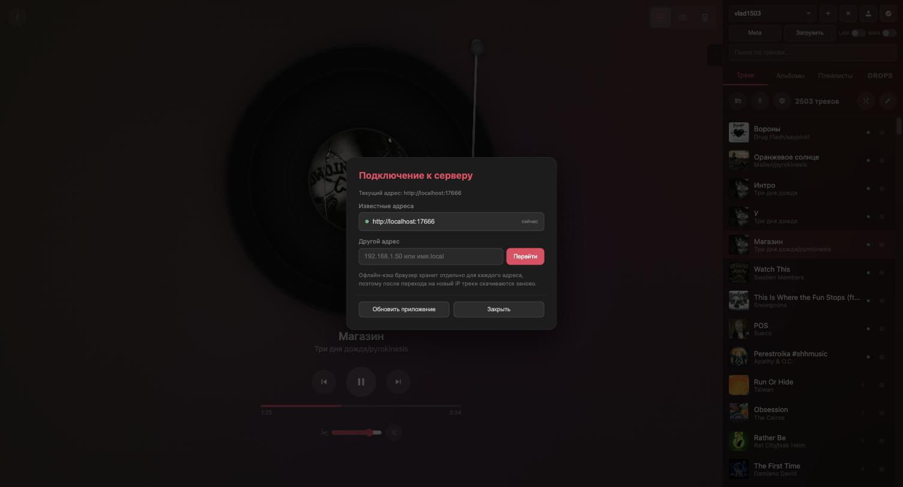

Раздача по локальной сети и наружу включается двумя переключателями в шапке.
Для HTTPS есть свой корневой сертификат, а при желании — настоящий сертификат
Let's Encrypt через DNS-валидацию, с неразрушающей отвязкой.

---

## Управление вне приложения

* **Экран блокировки и Пункт управления** — обложка, название, кнопки, полоса
  перемотки.
* **CarPlay** — то же самое на экране машины.
* **Кнопки на руле и на наушниках** переключают треки; вид кнопок виджета
  выбирается в настройках, потому что система решает его по составу
  зарегистрированных команд (либо стрелки треков, либо полоса прокрутки —
  одновременно нельзя).
* **Медиа-клавиши клавиатуры Mac** (F7/F9) — тоже переключение треков.
* **Виджет Übersicht** на рабочем столе macOS.

---

## Настройки и диагностика

### Графика и энергопотребление

Каждый пункт снимает конкретную нагрузку и честно объясняет, что именно
изменится. Самый дорогой — размытие панели: оно пересчитывается на каждом кадре
под всем списком.

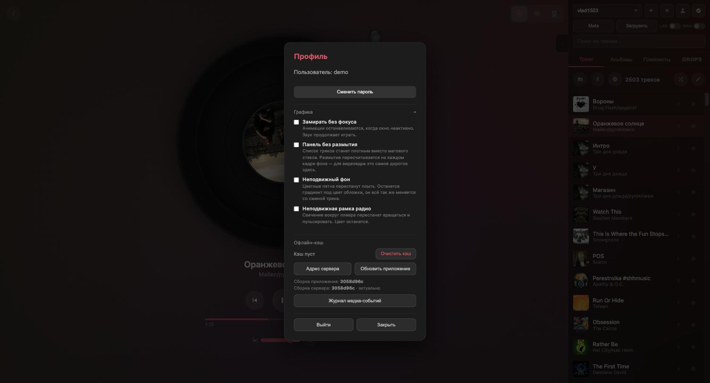

Анимации останавливаются, когда окно скрыто: считать кадры для того, чего никто
не видит, бессмысленно. Замер до/после: 54 → 24 млн пиксельных операций в
секунду при том же виде.

### Журнал медиа-событий

Отладка воспроизведения на заблокированном экране иначе невозможна: Web
Inspector требует кабеля и Mac под рукой, а нужное состояние живёт ровно те
секунды, пока экран заблокирован.

Журнал пишет вызовы кнопок виджета, события аудио-элемента, переходы страницы в
фон и снимок состояния рядом с каждой записью. Отдельно — детектор заикания
(сверяет прирост времени с реальным) и сторож замирания.

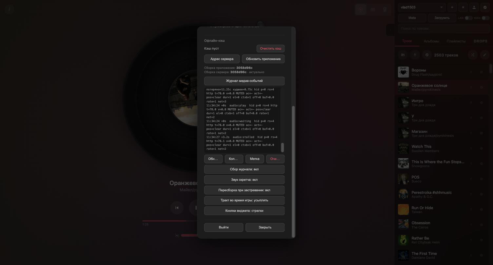

Этим журналом и был пойман самый неприятный дефект за всю историю проекта:
заикание в CarPlay, которое расползалось на **другие** приложения. Виноват
оказался живой `AudioContext` скретча — он держит настроенной общую
аудиосессию системы, даже когда спит и ничего не воспроизводит. Теперь контекст
существует только пока крутят пластинку.

---

## Под капотом

| | |
|---|---|
| Сервер | Python, стандартный `http.server`, без фреймворков |
| Фронтенд | один файл, ES5, **ноль зависимостей и ноль сборки** |
| Размер | `vinyl_player.py` — 18 453 строки, 880 КБ: сервер, HTML, CSS и JS целиком |
| Хранилище клиента | IndexedDB (аудио, обложки, зеркало DROPS) + localStorage |
| Форматы | mp3, flac, m4a, ogg, wav, aac, opus, aiff, alac |
| Платформы | macOS, Windows, Linux; PWA на iOS/iPadOS; обёртка под Android |

Данные лежат файлами в домашней папке с правами `600`; плейлисты и разметка
периодов — внутри самого каталога музыки, поэтому переезжают вместе с ним.

---

*Скриншоты сняты автоматически через браузер на изолированном экземпляре
сервера. Положение воспроизведения на кадрах подставлено: браузер под
автоматизацией не декодирует аудио и не выполняет анимацию в фоновой вкладке,
поэтому интерфейс отрисован собственным кодом приложения по подменённым
`duration` и `currentTime`.*
